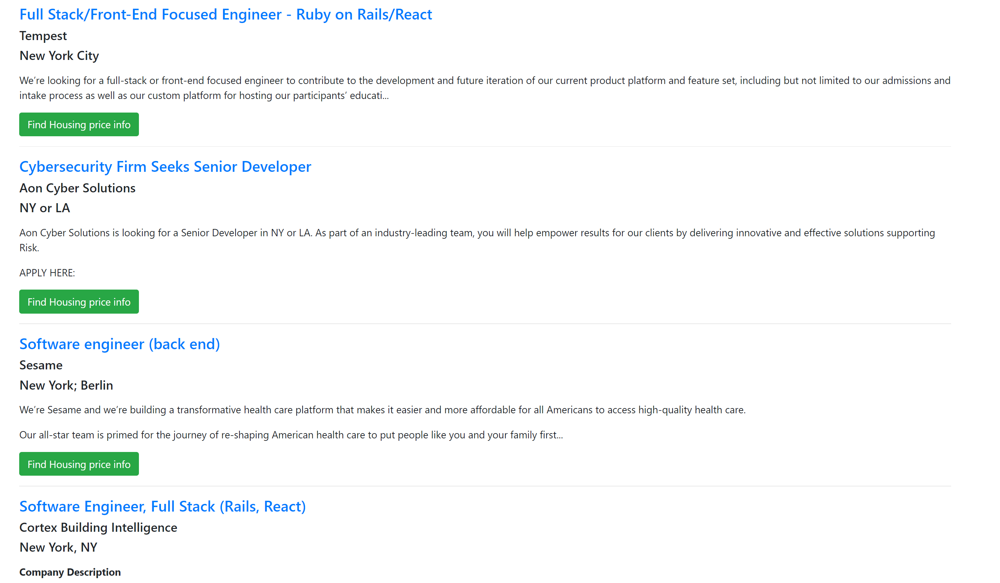

# JobSearch

Sowtware Developers JobSearch Using Github Jobs Search API Search for jobs by term, location, full time vs part time.
All parameters are optional.
Based of the search result user can find housing price info.

## The Motivation for Development
New job is an important life change and happens more often in today’s global workplace. 
The application helps to find, explore and research both a new job and new location.

## Technologies Used
* Javascript
* API used : GitHub Jobs API, Zillow Real Estate Research API.
* CSS
* Bootstrap
* AJAX
 DEMO [https://squarefozilov.github.io/JobSearch/]

## Installing

To run the application locally, you will need to clone the repository to your local machine.

HTTPS:
````
$ git clone https://github.com/squarefozilov/JobSearch.git
````
SSH:
````
$ git clone git@github.com:squarefozilov/JobSearch.git
````
## Product features
* **JobSearch** is a application that allows users search IT related jobs.

*
* After clicking search button application shows available jobs based on term and location of the user input.

* Based of the search result user can look for housing prices based on the location by clicking `Find housing ` button.


---
## Direction for Future Development
* Find better API to list the real estate for sale/rental with its price, address.
* Information on local amenities will be added so restaurants, market and shopping can be found. 
 Project Link: [https://squarefozilov.github.io/JobSearch/] (https://github.com/squarefozilov/JobSearch)
